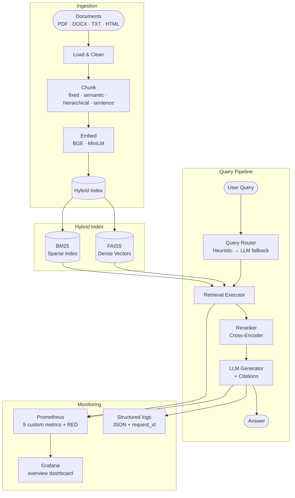
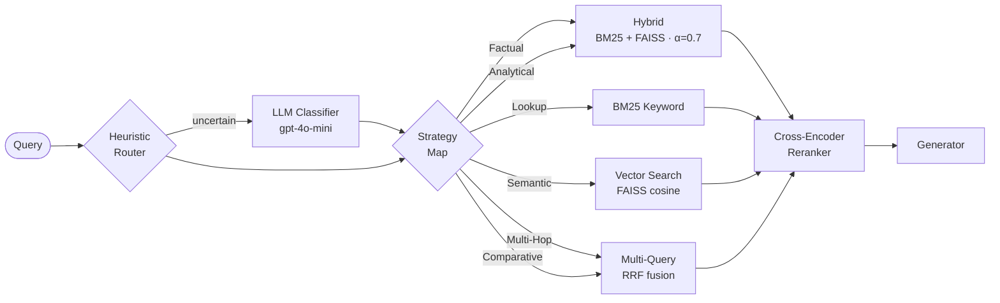

# RAGCore — rigorously evaluated multi-strategy RAG

A retrieval-augmented generation system with hybrid FAISS + BM25 retrieval,
automatic query routing, and a configurable Self-RAG generation path.
The pipeline is benchmarked end-to-end against FiQA-2018, with results,
failure mode documentation, and reproducible scripts committed alongside
the code.
Two faithfulness metrics — token-overlap and LLM-judged (RAGAS) —
disagree on whether Self-RAG helps. Both deltas are statistically
significant. The disagreement, not Self-RAG itself, is the headline
finding.

[](https://github.com/Kollipara-Hema/ragcore/actions)
[](https://codecov.io/gh/Kollipara-Hema/ragcore)
[](LICENSE)
[](https://www.python.org/)
[](https://fastapi.tiangolo.com/)

---

## Table of Contents

- [Live demo](#live-demo)
- [Headline Results](#headline-results)
- [Architecture](#architecture)
- [Retrieval Strategy Routing](#retrieval-strategy-routing)
- [Quick Start](#quick-start)
- [Monitoring](#monitoring)
- [API Reference](#api-reference)
- [Configuration](#configuration)
- [Project Structure](#project-structure)
- [Testing](#testing)
- [Status](#status)
- [Project Artifacts](#project-artifacts)
- [Recent Updates](#recent-updates)
- [What's next](#whats-next)

---

## Live demo

**[ragcore.streamlit.app](https://ragcore.streamlit.app)** — try the deployed demo

Indexed on [FiQA-2018](https://huggingface.co/datasets/explodinggradients/fiqa) (380 chunks of personal-finance Q&A). Llama 3.3 70B via Groq for generation, FAISS + BM25 hybrid retrieval, ms-marco cross-encoder reranking. Optional Self-RAG verification toggle in the sidebar.

First request may take ~30s on free tier (Render cold start).


---
## Headline Results

Benchmarked on 50 FiQA-2018 financial Q&A queries. Retrieval metrics are
identical between strategies by construction (same retrieval path); the
meaningful comparison is faithfulness, where the two metrics disagree.

| Metric | Baseline | Self-RAG | Delta | Run range | p |
|---|---|---|---|---|---|
| hit@5 | 0.92 | 0.92 | — | — | — |
| MRR | 0.86 | 0.86 | — | — | — |
| NDCG@5 | 0.75 | 0.75 | — | — | — |
| faithfulness (word-overlap) | 0.36 | 0.42 | +0.054 | [0.032, 0.083] | 0.0002 |
| faithfulness (RAGAS, gpt-4o-mini) | 0.55 | 0.46 | −0.085 | [−0.115, −0.065] | 0.007–0.069 |
| mean latency | 5.9s | 10.6s | +79% | — | — |

The two faithfulness metrics give opposite verdicts. Word-overlap says
Self-RAG is more faithful (+15% relative). RAGAS says Self-RAG is less
faithful, with a mean delta of −0.085 across three judge-controlled
re-runs (range −0.115 to −0.065; Wilcoxon p straddles α=0.05 across
runs at 0.007, 0.049, 0.069). On baseline answers, the two metrics
negatively correlate (Spearman ρ = −0.385, p=0.006) — they are not
measuring the same thing.

The April analysis reported a single-run RAGAS delta of −0.109, within
the range observed across reruns above. The single point estimate
overstates the precision of the underlying instrument: RAGAS at n=50
has a per-query noise floor of ~0.07–0.09 mean absolute difference
between re-runs of identical data, comparable in magnitude to the
effect sizes being measured. The per-claim analysis (linked below)
characterizes this non-determinism and the structural disagreement
between Self-RAG's internal verifier and the RAGAS judge.

A plausible mechanism: Self-RAG decomposes answers into atomic claims,
which raises token overlap with contexts (helping word-overlap) but
creates more opportunities for any single claim to be flagged as
unsupported (hurting RAGAS). The per-claim analysis confirms a
structural finding: Pearson r between Self-RAG's internal verifier
and the RAGAS judge across paired queries is near zero (-0.12 to
-0.16, p > 0.3), and 34% of queries show internal-accept/RAGAS-reject
disagreement against only 3% in the reverse direction. The two
verifiers do not share a meaningful ranking signal even when they use
the same underlying model.

For the full statistical breakdown of the April run (paired bootstrap
CIs, Wilcoxon, Spearman cross-correlation), see
[evaluation/results/ragas_analysis_2026-04-26.md](evaluation/results/ragas_analysis_2026-04-26.md).
For the per-claim mechanism investigation, including the verifier-disagreement
finding and characterization of run-to-run instrument variance, see
[evaluation/results/per_claim_analysis_2026-05-05.md](evaluation/results/per_claim_analysis_2026-05-05.md).

The pre-registered analysis plan, written before the RAGAS run, is at
[docs/ragas_run_plan_2026-04-26.md](docs/ragas_run_plan_2026-04-26.md).

The methodology change made after seeing the first run (judge
max_tokens raised from default to 8192 to recover 14 verification-stage
truncations) is documented in the analysis file alongside the original
default-judge run preserved as evidence.

---

## Architecture


Citations include attributed_spans — the parser extracts the clause preceding each `<cite source="N">` trailing marker emitted by the LLM, allowing the UI to render inline yellow highlights with source chips.
---

## Retrieval Strategy Routing

The router runs in two passes: a fast regex heuristic catches obvious patterns
(lookup, analytical, multi-hop), then falls back to a cheap LLM call
(GPT-4o-mini, temp=0) for ambiguous queries.



| Query Type | Primary | Fallback | Triggered by |
|-----------|---------|----------|-------------|
| Factual | Hybrid (α=0.7) | Semantic | "What is X?" |
| Lookup | BM25 Keyword | Semantic | "Find doc by author / date" |
| Semantic | Vector (FAISS) | Hybrid | "Explain how X relates to Y" |
| Multi-Hop | Multi-Query + RRF | Hybrid | "X which then affects Y" |
| Analytical | Hybrid (α=0.7) | Semantic | "Summarize / analyze / compare" |
| Comparative | Multi-Query + RRF | Hybrid | "Differences between X and Y" |

---

## Quick Start

### FAISS (built-in, no Docker required)

The fastest way to run locally. FAISS runs in-process; no separate vector
store service needed.

```bash
git clone https://github.com/Kollipara-Hema/ragcore.git
cd ragcore
python -m venv .venv && source .venv/bin/activate
pip install -e .

cp .env.example .env
# Edit .env:
#   VECTOR_STORE_PROVIDER=faiss
#   LLM_PROVIDER=groq    # set GROQ_API_KEY, or use openai / anthropic

uvicorn api.main:app --reload --port 8000
# Docs: http://localhost:8000/docs
```

Both FAISS and Chroma are verified end-to-end. Weaviate, Pinecone, and Qdrant
configuration keys exist but are not implemented; selecting them logs a warning
and falls back to FAISS.

### Full Stack with Docker Compose

API, Celery workers, and Redis in one command.

```bash
cp .env.example .env
# Edit .env with your LLM API key and VECTOR_STORE_PROVIDER=faiss

docker-compose up --build
# API:    http://localhost:8000
# Docs:   http://localhost:8000/docs
# Flower: http://localhost:5555
```

### UI Frontends

```bash
# Streamlit — dashboard with file upload
cd ui_streamlit && streamlit run app.py

# Chainlit — conversational chat
cd ui_chainlit && chainlit run app.py
```

---

## Monitoring

After `docker compose up`, Prometheus scrapes the API's `/metrics` endpoint every 15 seconds and is accessible at `http://localhost:9090`. The `ragcore_api` scrape target should show as **UP** within one scrape interval; verify at `http://localhost:9090/targets`.

Grafana is available at `http://localhost:3000` (default credentials: `admin` / `admin`). The **RAGCore Overview** dashboard is preloaded under Dashboards → RAGCore and displays request rate, p95 latency, stage durations, token usage, Self-RAG claim outcomes, process memory, and vector store disk usage.


---

## API Reference

### Ingest

```bash
# Async (default) — returns job_id immediately, processes in background via Celery
curl -X POST http://localhost:8000/ingest/file \
  -F "file=@report.pdf" \
  -F "title=Q3 Report 2024" \
  -F "tags=finance,quarterly"

# Check job status
curl http://localhost:8000/ingest/status/<job_id>

# Synchronous — waits for completion (use for small files)
curl -X POST http://localhost:8000/ingest/file \
  -F "file=@notes.txt" \
  -F "async_processing=false"
```

### Query

```bash
# Auto-routed query (system picks the best strategy)
curl -X POST http://localhost:8000/query \
  -H "Content-Type: application/json" \
  -d '{"query": "What were the key findings in the Q3 report?", "top_k": 5}'

# With strategy override and metadata filter
curl -X POST http://localhost:8000/query \
  -H "Content-Type: application/json" \
  -d '{
    "query": "What is the return policy?",
    "metadata_filter": {"doc_type": "pdf"},
    "strategy_override": "keyword"
  }'

# Streaming response (SSE)
curl -X POST http://localhost:8000/query/stream \
  -H "Content-Type: application/json" \
  -d '{"query": "Summarize the main points."}' \
  --no-buffer
```

---

## Configuration

All settings are environment-variable driven. Copy `.env.example` → `.env`.

### Retrieval

| Setting | Default | Options / Effect |
|---------|---------|-----------------|
| `VECTOR_STORE_PROVIDER` | `faiss` | `faiss` · `chroma` |
| `CHUNKING_STRATEGY` | `semantic` | `fixed` · `semantic` · `hierarchical` · `sentence` |
| `HYBRID_ALPHA` | `0.7` | `0` = keyword only · `1` = vector only |
| `RETRIEVAL_TOP_K` | `20` | Candidates before reranking |
| `RERANK_TOP_K` | `5` | Final chunks sent to LLM |
| `ENABLE_RERANKING` | `true` | Two-stage retrieval with cross-encoder |
| `ENABLE_QUERY_EXPANSION` | `false` | Multi-query paraphrasing for complex questions |

### Generation

| Setting | Default | Options / Effect |
|---------|---------|-----------------|
| `LLM_PROVIDER` | `groq` | `groq` · `openai` · `anthropic` · `ollama` · `demo` |
| `GROQ_API_KEY` | — | Required if `LLM_PROVIDER=groq` |
| `OPENAI_API_KEY` | — | Required if `LLM_PROVIDER=openai` |
| `ANTHROPIC_API_KEY` | — | Required if `LLM_PROVIDER=anthropic` |
| `AZURE_OPENAI_ENDPOINT` | — | Azure OpenAI resource endpoint |
| `AZURE_OPENAI_API_KEY` | — | Azure OpenAI API key |
| `AZURE_OPENAI_DEPLOYMENT` | — | Model deployment name |
| `AZURE_OPENAI_API_VERSION` | `2024-02-15-preview` | Azure API version |
| `GENERATION_STRATEGY` | `basic` | `basic`, `self_rag` (claim verification loop), `flare` (FLARE-inspired with numeric-novelty re-retrieval trigger), `agentic` (scaffolded — falls through to basic). |

### Evaluation

| Setting | Default | Effect |
|---------|---------|--------|
| `ENABLE_EVALUATION` | `false` | LLM-based confidence scoring per answer |
| `EVAL_STRATEGY` | `heuristic` | `heuristic` · `ragas` (requires `pip install -e ".[eval]"`) |
| `RAGAS_ENABLED` | `false` | Enable RAGAS faithfulness + relevance metrics |

### Infrastructure

| Setting | Default | Effect |
|---------|---------|--------|
| `REDIS_URL` | `redis://localhost:6379/0` | Redis connection for Celery + long-term memory |
| `WEAVIATE_URL` | `http://localhost:8080` | Weaviate host |
| `CHROMA_PERSIST_DIR` | `./chroma_db` | Local Chroma persistence directory |
| `FAISS_DATA_DIR` | `./faiss` | Directory for FAISS index and metadata files. Set to a persistent-disk path on platforms with ephemeral filesystems (e.g., Render). |
| `ENABLE_TRACING` | `false` | Send traces to Langfuse |
| `LANGFUSE_PUBLIC_KEY` | — | Langfuse public key |
| `LANGFUSE_SECRET_KEY` | — | Langfuse secret key |

### CORS

| Setting | Default | Effect |
|---------|---------|--------|
| `CORS_ORIGINS` | `http://localhost:8501` | Comma-separated allowed origins for cross-origin requests. Set to your frontend's URL in production. |

### API Key Authentication

API key auth is **off by default** so the Streamlit demo at [ragcore.streamlit.app](https://ragcore.streamlit.app) remains accessible to reviewers without configuration. When enabled, every non-exempt endpoint requires the `X-API-Key` request header. Exempt paths (always reachable without a key): `/health`, `/health/live`, `/health/ready`, `/metrics`. The Streamlit UI reads `RAGCORE_API_KEY` from its own environment and forwards it automatically if set.

| Setting | Default | Effect |
|---------|---------|--------|
| `RAGCORE_AUTH_ENABLED` | `false` | When `true`, all non-exempt endpoints require `X-API-Key` header. |
| `RAGCORE_API_KEY` | — | Required when `RAGCORE_AUTH_ENABLED=true`. Use a long random string (e.g. `python -c 'import secrets; print(secrets.token_urlsafe(32))'`). |

---

## Project Structure

<details>
<summary>Expand directory tree</summary>

```
ragcore/
├── agent/                  # LangGraph agent
│   ├── graph.py            # Node wiring and conditional edges
│   ├── state.py            # AgentState TypedDict
│   └── nodes/              # router · retriever · reranker · generator · evaluator
│
├── api/                    # FastAPI application
│   └── main.py             # /ingest · /query · /query/stream · /agent/query · /health
│
├── config/
│   └── settings.py         # Pydantic settings — all env vars with defaults
│
├── embeddings/             # BGEEmbedder · MiniLMEmbedder · embedder factory
│
├── evaluation/
│   ├── evaluator.py        # Retrieval + generation metrics (MRR, NDCG, hit rate)
│   ├── datasets/           # FiQA-2018 eval set (50 queries, seed=42)
│   ├── notebooks/          # baseline_vs_selfrag.ipynb
│   ├── results/            # Raw JSON benchmark output (basic_fiqa.json, self_rag_fiqa.json)
│   └── scripts/            # run_benchmark.py · stage_b_sanity.py
│
├── generation/
│   ├── llm_service.py      # Provider switcher: Groq / OpenAI / Anthropic / Ollama
│   ├── advanced_generation.py  # SelfRAGGenerator · FLAREGenerator · AgenticRAG
│   └── prompts/            # Prompt templates
│
├── ingestion/
│   ├── chunkers/           # fixed · semantic · hierarchical · sentence
│   └── loaders/            # PDF · DOCX · TXT · HTML · GitHub · web
│
├── monitoring/
│   └── tracer.py           # NoOpTracer (default) · LangfuseTracer (optional)
│
├── reranking/
│   └── reranker.py         # CrossEncoderReranker · NoOpReranker
│
├── retrieval/
│   ├── router/
│   │   └── query_router.py # HeuristicRouter · LLMQueryClassifier · STRATEGY_MAP
│   └── strategies/
│       └── retrieval_executor.py
│
├── tests/
│   ├── unit/               # 75 tests — no external services required
│   └── integration/        # 25 tests — FAISS in-memory, mocked external services
│
├── docs/
│   └── debugging-notes.md
│
├── utils/
│   └── models.py           # Shared types: Chunk · Document · RetrievedChunk
│
└── vectorstore/
    └── vector_store.py     # FAISSVectorStore · get_vector_store() singleton
```

</details>

---

## Testing

```bash
# Unit tests only (no external services needed)
pytest tests/unit/ -v

# Integration tests
pytest tests/integration/ -v

# With coverage
pytest tests/unit/ --cov=. --cov-report=html
```

Current: 144 unit tests passing, 44 of 45 integration tests passing. One
integration test (`test_agent_graph_with_tracing`) fails due to a pre-existing
mock-target resolution bug in the test itself, unrelated to current work.

---

## Status

### Working end-to-end

- Document ingestion: PDF, DOCX, text, HTML, web, GitHub via 8 loaders and 4
  chunking strategies
- Hybrid retrieval: FAISS dense + BM25 sparse with configurable alpha fusion
- Cross-encoder reranking
- Query routing: heuristic regex + LLM fallback, dispatches to 5 of 6
  retrieval strategies; parent-child is enumerated but not wired
- Basic and Self-RAG generation paths, configurable via `GENERATION_STRATEGY`
- FLARE-inspired iterative generation: dollar-token novelty between response and retrieved chunks triggers re-retrieval; configurable via `GENERATION_STRATEGY=flare`. Heuristic deviates from Jiang et al. 2023 (which uses token logprobs unavailable on Groq's Llama 3.3 70B endpoint); see the `FLAREGenerator` docstring for rationale.
- Retrieval evaluation: MRR, NDCG@5, hit@5, precision@5, recall@5 — all
  correctly bounded after dedup fix (see debugging notes)
- LLM-judged faithfulness via RAGAS (gpt-4o-mini judge) on the same 50 FiQA
  queries, with paired bootstrap confidence intervals and Wilcoxon signed-rank
  significance testing — pre-registered analysis plan committed before the run
- FiQA-2018 benchmark runner and comparison notebook
- Citation span attribution with inline highlights (yellowmark + numbered source chips)
- Follow-up question suggestions (LLM-generated, click to prefill chat)
- Hallucination verifier toggle (per-query Self-RAG opt-in, ~3x slower)
- Per-query pipeline section in sidebar (router, retrieve, rerank, generate, 
  latency, tokens, confidence with recalibrated thresholds)
- Real Prometheus metrics: 5 custom `ragcore_*` metrics (stage duration
  histogram, generation tokens, Self-RAG claims, process memory, vector
  store disk bytes) plus RED metrics on every endpoint via
  `prometheus-fastapi-instrumentator`. Scraped by Prometheus at 15s
  intervals; Grafana dashboard with overview panels preloaded via
  provisioning.
- Deep health checks: `/health/live` (process alive) and
  `/health/ready` (vector store ping, embedder smoke test, LLM API key
  validation). Returns 200 all-pass or 503 with structured per-check
  failures. Original `/health` retained for Render's default monitor.
- Structured JSON logging via structlog with request-ID correlation.
  `RequestIdMiddleware` honors inbound `X-Request-Id` header or
  generates UUID4; binds into context so every log line during request
  handling carries the field. Echoed in response header.
- Self-RAG verifier robustness: two latent bugs found and fixed during
  benchmark runs. Exception handler in `_verify_claim` was fail-open
  (silently promoting unparseable responses to verified) — now fail-closed.
  `_extract_claims` and `_verify_claim` did not strip markdown code
  fences before `json.loads`, causing all benchmark-shape responses
  from gpt-4o-mini to land in the exception handler. Both fixes
  covered by 6 regression tests.

### Deferred or scaffolded

- Monitoring: `NoOpTracer` methods are all `pass`; Langfuse tracing is
  off by default and never exercised end-to-end against a live
  instance. Prometheus and Grafana now wired and verified locally.
- Multi-vector-store: FAISS and Chroma are both verified end-to-end with hybrid
  retrieval via the shared BM25Index helper, and both pass the same parity test
  surface. Weaviate, Pinecone, and Qdrant remain config-only fall-throughs with
  an explicit warning log; they are not documented options.
- Agentic RAG: code is in `generation/advanced_generation.py` but not wired to the orchestrator; `GENERATION_STRATEGY=agentic` falls through to basic generation
- RAGAS evaluation runs end-to-end and produces the LLM-judged faithfulness
  numbers in the headline table. Word-overlap retained alongside RAGAS as the
  displaceable historical metric — the headline finding is that the two metrics
  disagree on Self-RAG.

---

## Project Artifacts

- [AUDIT.md](AUDIT.md) — Module-by-module assessment of what's implemented
  versus what's scaffolded or deferred, with README claims rated REAL / PARTIAL /
  OVERSTATED and five previously-undocumented bugs.
- [evaluation/results/ragas_analysis_2026-04-26.md](evaluation/results/ragas_analysis_2026-04-26.md) —
  RAGAS vs word-overlap faithfulness analysis on 50 FiQA queries. Paired
  bootstrap CIs, Wilcoxon signed-rank tests, cross-metric Spearman correlation,
  top-outlier query analysis, mechanism hypothesis, and limitations. Documents
  the metric disagreement that motivates the README headline.
- [evaluation/results/per_claim_analysis_2026-05-05.md](evaluation/results/per_claim_analysis_2026-05-05.md) —
  Per-claim faithfulness analysis under controlled conditions
  (gpt-4o-mini as generator, Self-RAG verifier, and RAGAS judge).
  Documents the structural disagreement between the two verifiers
  (Pearson r near zero across paired queries, 34% internal-accept/
  RAGAS-reject vs 3% reverse) and characterizes RAGAS instrument
  non-determinism (per-query noise floor 0.05-0.09; Wilcoxon p
  straddles α=0.05 across reruns of identical data). Self-updating
  writeup with f-string substitutions; numbers regenerate on each
  notebook run.
- [docs/ragas_run_plan_2026-04-26.md](docs/ragas_run_plan_2026-04-26.md) —
  Pre-registered analysis plan, written before the RAGAS benchmark ran. Decision
  rules committed in advance for three result scenarios; the RAGAS regression
  triggered Rule 3 (rewrite README), which is what this README does.
- [docs/debugging-notes.md](docs/debugging-notes.md) — Real bugs caught
  during development: vector store singleton, UUID/corpus-ID mismatch, metric
  inflation from duplicate chunk IDs, Self-RAG prompt escaping. Each entry
  includes symptom, root cause, fix, and regression test.
- [evaluation/notebooks/baseline_vs_selfrag.ipynb](evaluation/notebooks/baseline_vs_selfrag.ipynb) —
  Baseline vs Self-RAG across 50 FiQA queries. Per-query faithfulness delta,
  latency and token histograms, Self-RAG internals (regen rate, claim counts).
- [evaluation/results/](evaluation/results/) — Raw benchmark JSON for both
  strategies. Reproducible:
  `python evaluation/scripts/run_benchmark.py --strategy basic`

---
## Recent Updates

| Date | What changed |
|---|---|
| 2026-05-08 | Grafana dashboard screenshot and Recent Updates section added |
| 2026-05-07 | AUDIT and README refreshed to reflect the past week's batch |
| 2026-05-06 | Per-claim faithfulness analysis: characterized RAGAS judge non-determinism (0.05-0.09 noise floor at n=50) and structural verifier disagreement (Pearson r ≈ -0.14 between Self-RAG verifier and RAGAS judge using the same model) |
| 2026-05-06 | Self-RAG verifier robustness: fixed fail-open exception handler and markdown fence parsing; both bugs were silently corrupting benchmark runs |
| 2026-05-04 | Structured JSON logging with request-ID correlation via middleware |
| 2026-05-03 | Grafana dashboard with overview panels (request rate, latency, stage durations, token rate, Self-RAG claims, memory, disk) |
| 2026-05-03 | Prometheus scraping the API every 15s; full docker-compose stack runnable locally |
| 2026-04-30 | Real Prometheus metrics on /metrics: 5 custom metrics + RED metrics on every endpoint |
| 2026-04-30 | Deep health checks: /health/live and /health/ready with vector store, embedder, and LLM config validation |

For full commit history: `git log --oneline -30`

---
## What's next

- Wire Agentic RAG into the generation strategy dispatch (code exists in
  `advanced_generation.py`, not yet called by orchestrator)
- Manual claim-level annotation on the 13 internal-accept/RAGAS-reject
  queries to determine whether they reflect real grounding errors or
  overzealous RAGAS rejection (per-claim analysis investigated the
  mechanism but did not adjudicate individual claims).
- Expand to the full FiQA test split (~648 queries) to tighten confidence
  intervals on both faithfulness deltas
- Cross-model judge comparison (gpt-4o vs gpt-4o-mini) to test whether
  the verifier disagreement and noise floor findings hold under a
  stronger judge.
