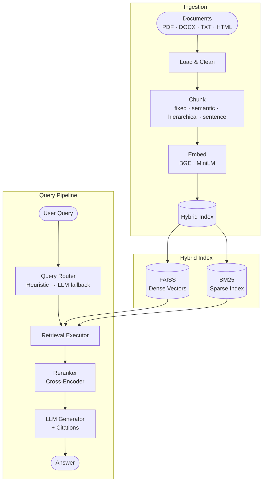
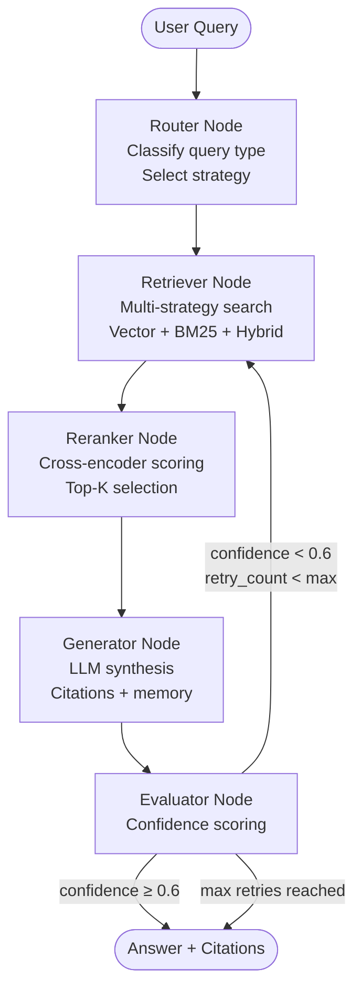

# DocIntel — Production-Grade Multi-Strategy RAG System

> Plain LangChain RAG uses one retrieval strategy for every query. DocIntel doesn't.
> It classifies each query, routes it to the optimal strategy (keyword, semantic, hybrid, or multi-query), fuses BM25 sparse retrieval with FAISS dense search, reranks results with a cross-encoder, and runs the whole pipeline through a LangGraph agent with memory and automatic retry. Built for developers who need something that holds up beyond a Jupyter notebook.

[](https://github.com/Kollipara-Hema/ragcore/actions)
[](https://codecov.io/gh/Kollipara-Hema/ragcore)
[](LICENSE)
[](https://www.python.org/)
[](docker-compose.yml)
[](https://fastapi.tiangolo.com/)

---

## Table of Contents

- [Features](#features)
- [Architecture](#architecture)
- [Retrieval Strategy Routing](#retrieval-strategy-routing)
- [Multi-Agent Graph](#multi-agent-graph)
- [Demo](#demo)
- [Quick Start](#quick-start)
- [API Reference](#api-reference)
- [Configuration](#configuration)
- [Project Structure](#project-structure)
- [Testing](#testing)
- [Evaluation](#evaluation)
- [Cloud Deployment](#cloud-deployment)
- [Roadmap](#roadmap)

---

## Features

| | |
|---|---|
| **6 retrieval strategies** | Auto-selected per query type: Hybrid, Keyword (BM25), Semantic, Multi-Query, Metadata Filter, Parent-Child |
| **Hybrid BM25 + FAISS** | Configurable alpha fusion with L2-normalized cosine scores |
| **Cross-encoder reranking** | Two-stage retrieval — broad recall first, precise reranking second |
| **LangGraph agent** | Multi-node graph with confidence-gated retry loop and conversation memory |
| **Multiple LLM providers** | Groq, OpenAI, Anthropic, Ollama — or `provider=demo` (no API key needed) |
| **Multiple vector stores** | Weaviate (self-hosted), FAISS (built-in), Chroma (local dev) |
| **3 UI frontends** | Chainlit (chat), Streamlit (dashboard), Gradio (quick demo) |
| **Full Docker stack** | API + Celery workers + Redis + Prometheus + Grafana in one `docker-compose up` |
| **84 tests passing** | Unit + integration coverage across all core components |

---

## Architecture



---

## Retrieval Strategy Routing

The router runs in two passes: a fast regex heuristic catches obvious patterns (lookup, analytical, multi-hop), then falls back to a cheap LLM call (GPT-4o-mini, temp=0) for ambiguous queries.


| Query Type | Primary | Fallback | Triggered by |
|-----------|---------|----------|-------------|
| Factual | Hybrid (α=0.7) | Semantic | "What is X?" |
| Lookup | BM25 Keyword | Semantic | "Find doc by author / date" |
| Semantic | Vector (FAISS) | Hybrid | "Explain how X relates to Y" |
| Multi-Hop | Multi-Query + RRF | Hybrid | "X which then affects Y" |
| Analytical | Hybrid (α=0.7) | Semantic | "Summarize / analyze / compare" |
| Comparative | Multi-Query + RRF | Hybrid | "Differences between X and Y" |

---

## Multi-Agent Graph



### Node Responsibilities

| Node | Input | Output |
|------|-------|--------|
| **Router** | Raw query string | `RoutingDecision` — strategy + expanded queries |
| **Retriever** | `RoutingDecision` | Ranked `RetrievedChunk` list |
| **Reranker** | Retrieved chunks | Top-K reranked chunks (CrossEncoder or NoOp) |
| **Generator** | Reranked chunks + history | `answer`, `citations`, `final_answer` |
| **Evaluator** | Generated answer | `confidence` float, `needs_retry` bool |

**Agent capabilities:**
- **Memory** — short-term conversation buffer (10 turns) + Redis-backed long-term store
- **Tools** — `search_docs`, `summarize_doc`, `compare_docs`, `get_metadata`
- **Retry loop** — automatic re-retrieval when `confidence < 0.6`
- **Tracing** — per-node timing, full execution logs via Langfuse (optional)

---

## Demo


> Run a UI locally — see [Quick Start](#quick-start) below.

---

## Quick Start

### Option A — No Docker (FAISS, built-in)

The fastest way to run locally. No Docker required — FAISS runs in-process.

```bash
git clone https://github.com/Kollipara-Hema/ragcore.git
cd ragcore
python -m venv .venv && source .venv/bin/activate
pip install -r requirements.txt

cp .env.example .env
# Edit .env:
#   VECTOR_STORE_PROVIDER=faiss       ← built-in, no Docker
#   LLM_PROVIDER=demo                 ← no API key needed
#   (or set GROQ_API_KEY / OPENAI_API_KEY / ANTHROPIC_API_KEY)

# Start Redis (needed for Celery async ingestion)
docker run -d -p 6379:6379 redis:7-alpine

uvicorn api.main:app --reload --port 8000
# Docs: http://localhost:8000/docs
```

### Option B — Weaviate (recommended for production)

Weaviate is the default vector store provider. Best feature set, horizontally scalable, self-hosted via Docker.

```bash
cp .env.example .env
# Edit .env:
#   VECTOR_STORE_PROVIDER=weaviate
#   WEAVIATE_URL=http://localhost:8080
#   LLM_PROVIDER=groq   (or openai / anthropic / ollama)

# Start Weaviate
docker run -d -p 8080:8080 \
  -e AUTHENTICATION_ANONYMOUS_ACCESS_ENABLED=true \
  -e DEFAULT_VECTORIZER_MODULE=none \
  semitechnologies/weaviate:1.24.1

# Start Redis
docker run -d -p 6379:6379 redis:7-alpine

uvicorn api.main:app --reload --port 8000
```

### Option C — Chroma (local dev, no Docker)

Simplest setup for development. Persists to a local directory, no server process needed.

```bash
# Edit .env:
#   VECTOR_STORE_PROVIDER=chroma
#   CHROMA_PERSIST_DIR=./chroma_db

uvicorn api.main:app --reload --port 8000
```

### Full Stack with Docker Compose

All services — API, Celery workers, Redis, Prometheus, Grafana — in one command.

```bash
cp .env.example .env
# Edit .env with your LLM API key and preferred VECTOR_STORE_PROVIDER

docker-compose up --build

# Services:
#   API:      http://localhost:8000        (REST + streaming)
#   Docs:     http://localhost:8000/docs   (Swagger UI)
#   Flower:   http://localhost:5555        (Celery task monitoring)
#   Grafana:  http://localhost:3000        (admin / admin)
```

### UI Frontends

```bash
# Chainlit — conversational chat
cd ui_chainlit && pip install -r requirements.txt && chainlit run app.py

# Streamlit — dashboard with file upload
cd ui_streamlit && pip install -r requirements.txt && streamlit run app.py

# Gradio — minimal comparison lab
cd ui_gradio && pip install -r requirements.txt && python app.py
```

---

## API Reference

### Ingest

```bash
# Async (default) — returns job_id immediately, processes in background via Celery
curl -X POST http://localhost:8000/ingest/file \
  -F "file=@report.pdf" \
  -F "title=Q3 Report 2024" \
  -F "tags=finance,quarterly"

# Check job status
curl http://localhost:8000/ingest/status/<job_id>

# Synchronous — waits for completion (use for small files)
curl -X POST http://localhost:8000/ingest/file \
  -F "file=@notes.txt" \
  -F "async_processing=false"
```

### Query

```bash
# Auto-routed query (system picks the best strategy)
curl -X POST http://localhost:8000/query \
  -H "Content-Type: application/json" \
  -d '{"query": "What were the key findings in the Q3 report?", "top_k": 5}'

# With strategy override and metadata filter
curl -X POST http://localhost:8000/query \
  -H "Content-Type: application/json" \
  -d '{
    "query": "What is the return policy?",
    "metadata_filter": {"doc_type": "pdf"},
    "strategy_override": "keyword"
  }'

# Streaming response (SSE)
curl -X POST http://localhost:8000/query/stream \
  -H "Content-Type: application/json" \
  -d '{"query": "Summarize the main points."}' \
  --no-buffer
```

### Agent Query (with memory + tools + retry)

```bash
curl -X POST http://localhost:8000/agent/query \
  -H "Content-Type: application/json" \
  -d '{
    "query": "What were the key findings in the Q3 report?",
    "session_id": "user-123",
    "trace_enabled": true
  }'
```

```json
{
  "answer": "Q3 revenue was $4.2B, representing 15% YoY growth...",
  "citations": [{"source": "Q3_report.pdf", "page": 4, "score": 0.91}],
  "confidence": 0.87,
  "retry_count": 0,
  "model_used": "gpt-4o-mini",
  "latency_ms": 1250,
  "trace_id": "abc-123-def"
}
```

---

## Configuration

All settings are environment-variable driven. Copy `.env.example` → `.env`.

### Retrieval

| Setting | Default | Options / Effect |
|---------|---------|-----------------|
| `VECTOR_STORE_PROVIDER` | `weaviate` | `weaviate` · `faiss` · `chroma` |
| `CHUNKING_STRATEGY` | `semantic` | `fixed` · `semantic` · `hierarchical` · `sentence` |
| `HYBRID_ALPHA` | `0.7` | `0` = keyword only · `1` = vector only |
| `RETRIEVAL_TOP_K` | `20` | Candidates before reranking |
| `RERANK_TOP_K` | `5` | Final chunks sent to LLM |
| `ENABLE_RERANKING` | `true` | Two-stage retrieval with cross-encoder |
| `ENABLE_QUERY_EXPANSION` | `true` | Multi-query paraphrasing for complex questions |

### Generation

| Setting | Default | Options / Effect |
|---------|---------|-----------------|
| `LLM_PROVIDER` | `groq` | `groq` · `openai` · `anthropic` · `ollama` · `demo` |
| `GROQ_API_KEY` | — | Required if `LLM_PROVIDER=groq` |
| `OPENAI_API_KEY` | — | Required if `LLM_PROVIDER=openai` |
| `ANTHROPIC_API_KEY` | — | Required if `LLM_PROVIDER=anthropic` |
| `AZURE_OPENAI_ENDPOINT` | — | Azure OpenAI resource endpoint |
| `AZURE_OPENAI_API_KEY` | — | Azure OpenAI API key |
| `AZURE_OPENAI_DEPLOYMENT` | — | Model deployment name |
| `AZURE_OPENAI_API_VERSION` | `2024-02-15-preview` | Azure API version |

### Evaluation

| Setting | Default | Effect |
|---------|---------|--------|
| `ENABLE_EVALUATION` | `false` | LLM-based confidence scoring per answer |
| `EVAL_STRATEGY` | `heuristic` | `heuristic` · `ragas` (requires `pip install ragas==0.1.7`) |
| `RAGAS_ENABLED` | `false` | Enable RAGAS faithfulness + relevance metrics |

### Infrastructure

| Setting | Default | Effect |
|---------|---------|--------|
| `REDIS_URL` | `redis://localhost:6379/0` | Redis connection for Celery + long-term memory |
| `WEAVIATE_URL` | `http://localhost:8080` | Weaviate host |
| `CHROMA_PERSIST_DIR` | `./chroma_db` | Local Chroma persistence directory |
| `ENABLE_TRACING` | `false` | Send traces to Langfuse |
| `LANGFUSE_PUBLIC_KEY` | — | Langfuse public key |
| `LANGFUSE_SECRET_KEY` | — | Langfuse secret key |

---

## Project Structure

<details>
<summary>Expand directory tree</summary>

```
ragcore/
├── agent/                  # LangGraph agent
│   ├── graph.py            # Node wiring and conditional edges
│   ├── state.py            # AgentState TypedDict (messages, confidence, retry_count, …)
│   ├── nodes/              # router · retriever · reranker · generator · evaluator
│   ├── tools/              # search_docs · summarize_doc · compare_docs · get_metadata
│   └── memory/             # short_term.py (buffer) · long_term.py (Redis)
│
├── api/                    # FastAPI application
│   ├── main.py             # /ingest · /query · /query/stream · /agent/query · /health
│   └── middleware/         # Request middleware
│
├── config/
│   └── settings.py         # Pydantic settings — all env vars with defaults
│
├── embeddings/             # BGEEmbedder · MiniLMEmbedder · embedder factory
│
├── evaluation/
│   ├── evaluator.py        # Retrieval + generation metrics (hit rate, MRR, NDCG)
│   └── dataset.py          # Sample golden Q&A dataset for benchmarking
│
├── generation/
│   ├── llm_service.py      # Provider switcher: Groq / OpenAI / Anthropic / Ollama / demo
│   └── prompts/            # Prompt templates
│
├── graph/
│   └── agent.py            # Top-level LangGraph graph definition
│
├── ingestion/
│   ├── chunkers/           # fixed · semantic · hierarchical · sentence chunkers
│   └── loaders/            # PDF · DOCX · TXT · HTML loaders
│
├── monitoring/
│   └── tracer.py           # Prometheus metrics + Langfuse tracing integration
│
├── reranking/
│   └── reranker.py         # CrossEncoderReranker · NoOpReranker
│
├── retrieval/
│   ├── router/
│   │   └── query_router.py # HeuristicRouter · LLMQueryClassifier · STRATEGY_MAP
│   └── strategies/
│       └── retrieval_executor.py  # _dispatch → semantic / keyword / hybrid / multi-query
│
├── tests/
│   ├── unit/               # Component tests — no external services required
│   └── integration/        # Pipeline tests with mocks (FAISS in-memory)
│
├── ui_chainlit/            # Chainlit conversational chat interface
├── ui_streamlit/           # Streamlit dashboard with file upload
├── ui_gradio/              # Gradio comparison lab
│
├── utils/
│   └── models.py           # Shared types: Chunk · Document · RetrievedChunk · AgentState
│
└── vectorstore/
    └── vector_store.py     # FAISSVectorStore — vector_search · keyword_search · hybrid_search
```

</details>

---

## Testing

```bash
# Unit tests only (no external services needed)
pytest tests/unit/ -v

# Integration tests (uses in-memory FAISS, no external services)
pytest tests/integration/ -v

# All tests with HTML coverage report
pytest tests/ --cov=. --cov-report=html --cov-omit="venv*,tests/*"
open htmlcov/index.html
```

**Current status: 84 / 84 tests passing**

---

## Evaluation

### Metrics available (rouge-score + bert-score, included in requirements)

- **Retrieval**: Hit rate, MRR, NDCG@5, precision / recall
- **Generation**: ROUGE-L, BERTScore, faithfulness, hallucination rate
- **Advanced** (optional): RAGAS faithfulness + answer relevance — `pip install ragas==0.1.7`
- **Latency**: P50 / P95 / P99 percentiles

### Run against your golden dataset

```python
from evaluation.evaluator import Evaluator

evaluator = Evaluator()
report = evaluator.evaluate("golden_dataset.csv")
# CSV columns: query, ground_truth, relevant_doc_ids
print(report)
```

### Use the included sample dataset

```python
from evaluation.dataset import get_sample_dataset

dataset = get_sample_dataset()
# Returns list[dict] — keys: query, ground_truth, relevant_doc_ids
```

### Enable tracing

```bash
# .env
ENABLE_TRACING=true
LANGFUSE_PUBLIC_KEY=your-key
LANGFUSE_SECRET_KEY=your-secret
```

---

## Cloud Deployment

### AWS ECS (Fargate)

```bash
aws ecr get-login-password | docker login --username AWS --password-stdin \
  <account>.dkr.ecr.<region>.amazonaws.com

docker build -t docintel .
docker tag docintel:latest <account>.dkr.ecr.<region>.amazonaws.com/docintel:latest
docker push <account>.dkr.ecr.<region>.amazonaws.com/docintel:latest
```

Recommended architecture:

| Component | Service | Size |
|-----------|---------|------|
| API | ECS Fargate | 2 vCPU · 4 GB × 2–4 tasks behind ALB |
| Workers | ECS Fargate | 4 vCPU · 8 GB × 2–8 tasks |
| Vector DB | Weaviate on ECS or Pinecone managed | — |
| Cache | ElastiCache Redis | r7g.large |
| Storage | S3 (raw docs) + EFS (model weights) | — |

---

## Roadmap

### Done ✅

- Hybrid BM25 + FAISS vector search with configurable alpha fusion
- 6 retrieval strategies with auto-routing (heuristic + LLM fallback)
- Multi-Query retrieval with Reciprocal Rank Fusion (RRF)
- Cross-encoder reranking (`CrossEncoderReranker` + `NoOpReranker`)
- LangGraph multi-node agent — retry loop with confidence gating
- Agent memory — short-term buffer (10 turns) + Redis long-term store
- Agent tools — `search_docs`, `summarize_doc`, `compare_docs`, `get_metadata`
- LLM providers — Groq, OpenAI, Anthropic, Ollama, demo mode (no key)
- Vector stores — Weaviate, FAISS, Chroma (configurable via env)
- 4 chunking strategies — fixed, semantic, hierarchical, sentence
- Streaming API (`/query/stream` — SSE)
- Async document ingestion via Celery + Redis
- Prometheus metrics + Grafana dashboards
- 3 UI frontends — Chainlit, Streamlit, Gradio
- CI/CD — GitHub Actions with lint + unit tests + Docker build

### In Progress 🔄

- **Real evaluation metrics** — `Evaluator` currently returns hardcoded values; ROUGE / BERTScore packages already in `requirements.txt`, wiring in progress
- **Azure OpenAI** — settings and env vars defined in `config/settings.py`; not yet wired through `LLMService`
- **Parent-child retrieval** — executor dispatch exists; fetch-by-parent-ID is a placeholder, not yet fully implemented

### Planned 📋

**Chunking**
- [ ] `PropositionalChunker` — extract atomic propositions for denser indexing
- [ ] `TableAwareChunker` — detect and preserve table structure

**Embeddings**
- [ ] Fine-tune BGE on domain-specific Q&A pairs
- [ ] Matryoshka embeddings (variable-dimension at query time)
- [ ] Late interaction models (ColBERT) for higher precision

**Hybrid Search Tuning**
- [ ] BM25 parameter tuning (k1, b) via grid search on eval set
- [ ] Adaptive alpha — tune `HYBRID_ALPHA` per query type from eval data
- [ ] SPLADE sparse-dense fusion

**Reranking**
- [ ] Fine-tune cross-encoder on domain data
- [ ] MonoT5 reranker for multilingual support
- [ ] LLM-based reranking (GPT-4o-mini pair scoring)

**Generation**
- [ ] Self-RAG — generate → verify claims against retrieved context → retrieve more if needed
- [ ] FLARE — forward-looking active retrieval
- [ ] Multi-turn agentic RAG with tool use for complex analytical queries

**Infrastructure**
- [ ] GraphRAG — knowledge graph layer for multi-hop reasoning
- [ ] Incremental indexing — skip re-indexing unchanged chunks
- [ ] A/B testing framework for strategy comparison
- [ ] API key authentication middleware
- [ ] Pinecone + Qdrant vector store backends
